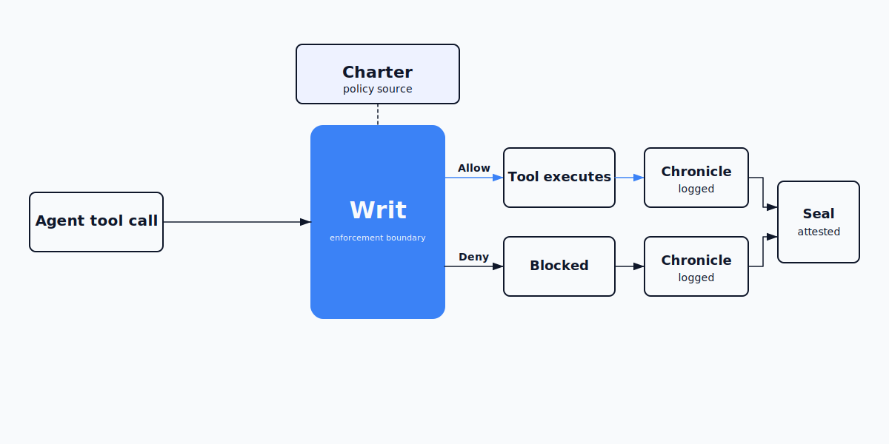

# Stipul

**Runtime authorization and audit evidence for AI agents.**



Agent authorization and audit platform for AI agents. Stipul enforces policy at the tool execution boundary, records every decision in a tamper-evident chain, and produces cryptographic proof of what actually happened.

[Quickstart](#see-it-work) · [Claude Code](docs/claude-code-quickstart.md) · [OpenAI Agents](integrations/openai-agents/) · [LangGraph](integrations/langgraph/) · [PyPI](https://pypi.org/project/stipul/) · [Docs](docs/)

---

## Why this matters now

AI agents are moving from chat into execution. They read files, call APIs, run shell commands, touch secrets, and interact with operational systems. Once an agent acts on the world, the question stops being "what did it say?" and becomes "what did it do, and can you prove it?"

Ordinary logging was not built to prove runtime enforcement. Logs can be edited, policy intent can drift from runtime behavior, and when something goes wrong — a leaked secret, an unauthorized deletion, a compliance violation — teams are left arguing over records instead of verifying them.

That gap is the problem Stipul exists to close. Not just governance — independently verifiable evidence of what your agents did.

## When you need this

A **support agent** reads customer files and calls web tools. You need an enforceable record of what it accessed, which outbound targets were denied, and whether the evidence still verifies later.

A **coding agent** touches filesystem and shell. You need hard policy boundaries before it can modify a repository or execute commands in CI — not a post-incident explanation built from logs.

If the answer to "can you prove it?" is "trust me" — you need Stipul.

## How Stipul works

You define policy in a **Charter**: what tools an agent can use, what is forbidden, where it may send traffic, and how much it may do. The Charter is declarative, version-controlled, and not overridable at runtime.

**Writ** enforces that Charter at the tool execution boundary. Every tool call is intercepted and evaluated against policy *before* it runs — not observed after the fact.

**Writ** enforces the **Charter**, records every decision in the **Chronicle**, and produces a cryptographic **Seal**.

Every enforcement decision is recorded in the **Chronicle**, a tamper-evident `events.jsonl` chain where each entry is linked to the previous one. Alterations are detectable because the chain no longer verifies.

The **Seal** binds the evidence chain to a cryptographic attestation. Verification checks the chain integrity and the seal together. If anything has been altered, Stipul rejects the record.

Policy → enforcement → evidence → proof.

## What makes Stipul different

**Runtime enforcement, not post-hoc observation.** Policy is applied before the tool call executes, not logged after it happens.

**Deterministic policy, not semantic classification.** Decisions are based on declarative rules — allowed tools, forbidden tools, egress allowlists — not ML models interpreting intent.

**Tamper-evident evidence, not structured logs.** Every decision is chained. Altering any entry breaks the chain and verification fails.

**Cryptographic attestation, not dashboard screenshots.** The Seal is a verifiable proof artifact, not a visual summary. It either checks out or it doesn't.

Other tools make agents governable. Stipul makes agent actions independently verifiable.

## See it work

Install Stipul as a CLI app with pipx (Python 3.10+):

```bash
pipx install stipul
stipul demo proof
```

The demo runs offline against a packaged Charter — no external dependencies, no framework integration required. It simulates an AI agent requesting tool access under a Stipul Charter, then shows what was allowed, denied, recorded, and sealed. The demo prints the exact verify and tamper commands. Copy and paste them in order.

```text
═══ Stipul Proof Demo ═══

Session: <session-id>

  seq 1  allow   filesystem.read      reason: allowed_tool
  seq 2  deny    web.search           reason: not_in_egress_allowlist
  seq 3  deny    shell.exec           reason: never_allow_tools
  seq 4  close   session_close

Trust: VERIFIED
  Chain: INTACT
  Seal:  VALID
  Decisions: 3
  Fingerprint: <session-id> | INTACT | VALID | 3 decisions | <fingerprint>

═══ Tamper Challenge ═══

The seal records a cryptographic attestation over the session evidence.
Inspect it yourself, verify the session as-is, then change a recorded value and re-verify.

Step 1 — View the current seal:

  cat <session-dir>/seal.json | python3 -m json.tool

Step 2 — Verify the session as-is:

  stipul verify <session-dir>

Expected clean verification:

  Trust: VERIFIED
  Chain: INTACT
  Seal: VALID

Step 3 — Now tamper with the seal:

  sed -i 's/"terminal_sequence_id": 5/"terminal_sequence_id": 999/' <session-dir>/seal.json

  Or try a different recorded value in seal.json and re-verify.

  sed -i 's/"version": 1/"version": 42/' <session-dir>/seal.json

Step 4 — Re-verify the session:

  stipul verify <session-dir>

Expected post-tamper verification:

  Trust: REJECTED
  Chain: INTACT
  Seal: INVALID

Proof complete: enforcement decisions recorded, chained, and sealed.
```

For real agent attach paths, see the integration quickstarts below.

## Integrations

Stipul integrates with existing agent frameworks through a lightweight enforcement boundary:

- **[Claude Code](docs/claude-code-quickstart.md)** — review mode with sealed session verification
- **[OpenAI Agents SDK](integrations/openai-agents/)** — tool-call interception via stdio
- **[LangGraph](integrations/langgraph/)** — enforcement layer for LangChain agent graphs

## Start with proof

Run the packaged demo, inspect the evidence, tamper with the record, and verify that trust flips to rejected. Then run `stipul init` to scaffold a starter Charter for your own agent workflow.

## License

Apache 2.0

[PyPI](https://pypi.org/project/stipul/) · [Security Policy](SECURITY.md) · [Changelog](CHANGELOG.md)
